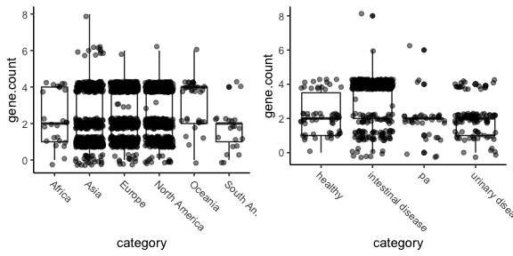

Testing differences in gene abundance among regions and pathotypes
================

# Introduction

The purpose of this analysis is to assess potential differences in the
distribution of a specific gene among microbes from a specific microbe.
Because this document is public, I’m not going to name the gene or the
microbe.

## ANOVA

A simple way to do this would be an ANOVA. Let’s try and check whether
the distributions of residuals and stability of variances look
reasonable.

``` r
library(tidyverse)
library(MASS)

# Load and pre-process the data by region and pathotype
region <- read_csv("data/region.csv") %>%
  filter(`gene number`!="TOTAL") %>%
  pivot_longer(cols = 2:7, names_to = "category", values_to = "count") %>%
  mutate(gene.count = as.numeric(`gene number`)) %>%
  dplyr::select(-`gene number`) %>%
  group_by(category) %>%
  mutate(freq = count / sum(count, na.rm = TRUE))

path <- read_csv("data/pathotype.csv") %>%
  #filter(`gene number`!="TOTAL") %>%
  pivot_longer(cols = 2:5, names_to = "category", values_to="count") %>%
  mutate(gene.count = as.numeric(`gene number`)) %>%
  dplyr::select(-`gene number`) %>%
  group_by(category) %>%
  mutate(freq = count / sum(count, na.rm = TRUE))

# I need to recreate the raw data to do an anova
# I wrote some *very* ugly code to do this, so I hid it in a separate file
source("R/recreate_raw_data.R")


raw_region_data <- recreate_raw(region) %>%
  arrange(category) # this appears to have worked
raw_path_data <- recreate_raw(path)

raw_plot <- function(df) {
  p <- ggplot(df, aes(x=category, y=gene.count)) + 
  geom_boxplot() + 
  geom_point(position=position_jitter(height = 0.3), alpha = 0.5) + 
  theme_classic() + 
  theme(axis.text.x = element_text(angle=-45, hjust=0))
  p
}

p_region <- raw_plot(raw_region_data)
p_path <- raw_plot(raw_path_data)
```



I don’t see obvious differences in distribution, but this is why we do
statistics I suppose.

Is a linear model (ANOVA) good for these data? Specifically: ANOVA is
fairly robust to unbalanced designs and to heteroskedasticity, but not
to hetereoskedastic data in an unbalanced design. So let’s check the
heteroskedasticity.

### Linear model for regions

``` r
region_model <- lm(gene.count ~ category, data=raw_region_data)
summary(aov(region_model))
```

                  Df Sum Sq Mean Sq F value   Pr(>F)    
    category       5     89   17.84    9.24 1.07e-08 ***
    Residuals   1781   3438    1.93                     
    ---
    Signif. codes:  0 '***' 0.001 '**' 0.01 '*' 0.05 '.' 0.1 ' ' 1

This model finds signficant differences among regions. But before we
take this too seriously, let’s check whether the residuals are normally
distributed. A good way to do that is via a QQ plot. The

``` r
plot(region_model, which=2) # actually these don't look as bad as I imagined?
```


Oof, that’s pretty grim. I’d say we these residuals are non-normally
distributed enough that I don’t think this is a great model.

We could do a Tukey post-hoc analysis to determine which categories are
significantly different from which. But given that QQ plot, I don’t
think we should go down that road.

### Linear model for pathotypes

``` r
path_model <- lm(gene.count ~ category, data=raw_path_data)
summary(aov(path_model))
```

                 Df Sum Sq Mean Sq F value Pr(>F)    
    category      3  207.8   69.28   47.19 <2e-16 ***
    Residuals   602  883.8    1.47                   
    ---
    Signif. codes:  0 '***' 0.001 '**' 0.01 '*' 0.05 '.' 0.1 ' ' 1

Again, significant differences among pathotypes.

``` r
plot(path_model, which=2)
```


Same situation here. Not great!

## Poisson distribution?

I propose that we can think of gene distribution as a poisson process,
where different values of $\lambda$ indicate different probabilities of
the gene being “handed out”. If this is the case, we can assess whether
there are difference in lambda among regions or pathotypes - but first
we need to assess whether the data are, in fact, poisson-distributed.
We’ll simply load the data, fit it to a poisson distribution, and see
whether the fit looks good. I think in this case a qualitative
assessment is at least as good as some kind fo statistical test of
goodness-of-fit.

``` r
d <- rbind(region %>% mutate(type="region"),
           path %>% mutate(type="path"))

test <- raw_region_data %>% filter(category=="Africa")
Africa_lambda <- MASS::fitdistr(test$gene.count, 
               densfun=dpois, 
               start=list(lambda = 1)) # Not sure what this warning is about
```

    Warning in stats::optim(x = c(0, 0, 1, 1, 1, 1, 1, 1, 1, 2, 2, 2, 2, 2, : one-dimensional optimization by Nelder-Mead is unreliable:
    use "Brent" or optimize() directly

``` r
Af_fits <- data.frame(x = 0:8, y=dpois(x=0:8, lambda=Africa_lambda$estimate))
ggplot() + 
  geom_line(data = Af_fits, aes(x=x, y=y)) + 
  geom_point(data = region %>% filter(category=="Africa"), aes(x=gene.count, y=freq)) + 
  scale_x_continuous(breaks = 0:8) # I think 3 and 4 is throwing it off. Hmm. 
```


