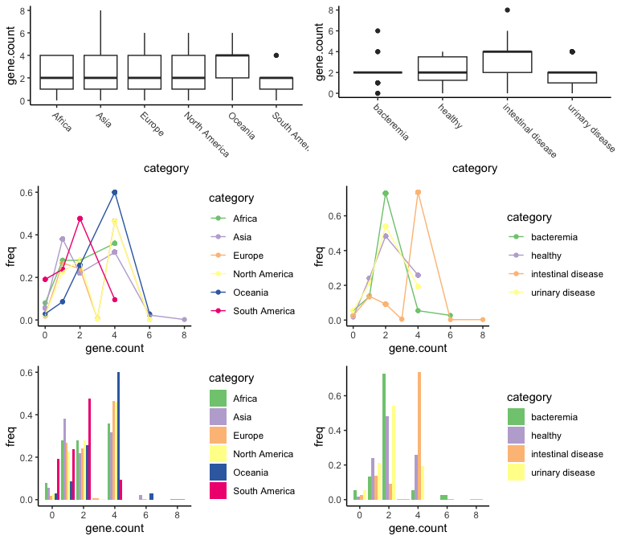
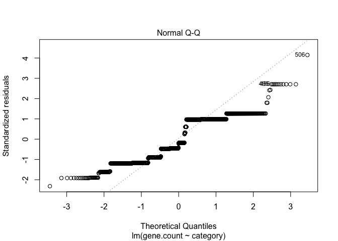
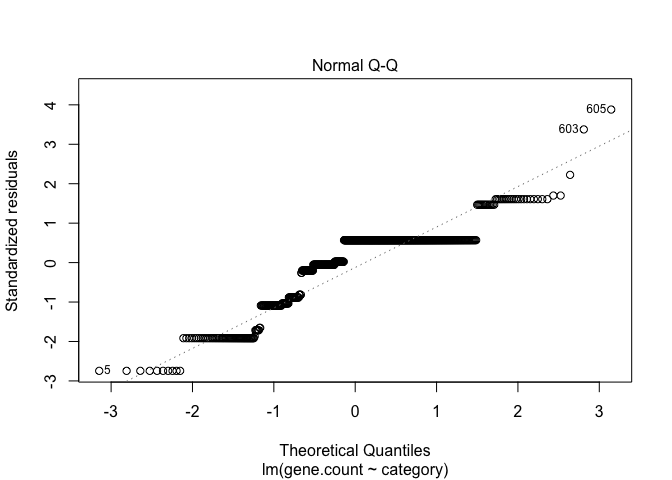
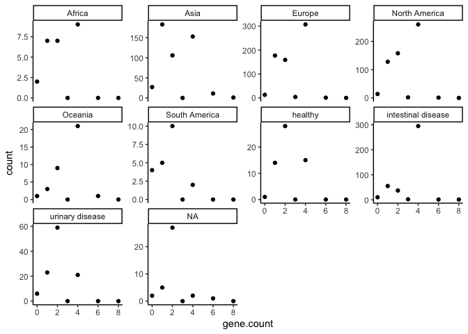
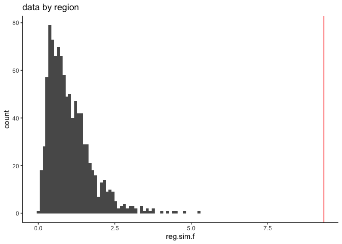
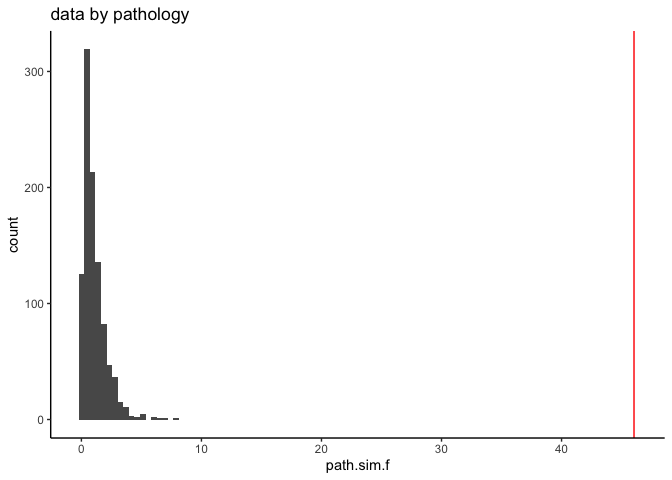

Testing differences in gene abundance among regions and pathotypes
================

# Introduction

The purpose of this analysis is to assess potential differences in the
distribution of a specific gene among microbes from a specific microbe.
Because this document is public, I’m not going to name the gene or the
microbe.

## ANOVA

A simple way to do this would be an ANOVA. Let’s try and check whether
the distributions of residuals and stability of variances look
reasonable.

``` r
library(tidyverse)
library(MASS)
library(furrr)
library(tictoc)
library(rlang) # this is maybe needed by calculate_mean_diff
plan(multisession)
source("R/helper_funs.R")
theme_set(theme_classic()) 

# Read in raw zor-orz data
region <- readxl::read_xlsx("data/FINAL data for Steen.xlsx", 
                            sheet = "zor-orz gene number",
                            range = "A11:G18") %>%
  rename(gene.count = Continent) %>%
  pivot_longer(-1, names_to = "category", values_to = "count") %>%
  group_by(category) %>%
  mutate(freq = count / sum(count, na.rm = TRUE))
  
path <- readxl::read_xlsx("data/FINAL data for Steen.xlsx", 
                            sheet = "zor-orz gene number",
                            range = "A1:E8") %>%
  rename(gene.count = Pathotype) %>%
  pivot_longer(-1, names_to = "category", values_to = "count") %>%
  group_by(category) %>%
  mutate(freq = count / sum(count, na.rm = TRUE))


raw_region_data <- recreate_raw(region) %>%
  arrange(category) # this appears to have worked
raw_path_data <- recreate_raw(path)

raw_plot <- function(df) {
  p <- ggplot(df, aes(x=category, y=gene.count)) + 
  geom_boxplot() + 
  #geom_point(position=position_jitter(height = 0.3), alpha = 0.5) + 
  theme_classic() + 
  theme(axis.text.x = element_text(angle=-45, hjust=0))
  p
}

p_region <- raw_plot(raw_region_data)
p_path <- raw_plot(raw_path_data)

raw_line_plot <- function(df) {
  p <- ggplot(df, aes(x=gene.count, y=freq, color=category)) + 
    geom_point() + 
    geom_line()  + 
    scale_color_brewer(type="qual")
  p
}

raw_bar_plot <- function(df) {
  p <- ggplot(df, aes(x=gene.count, y=freq, fill=category)) + 
    geom_bar(stat="identity", position="dodge") + 
    scale_fill_brewer(type="qual")
  p
}

# Make up plots for later display
p_reg_line <- raw_line_plot(raw_region_data)
p_path_line <- raw_line_plot(raw_path_data)
p_reg_bar <- raw_bar_plot(raw_region_data)
p_path_bar <- raw_bar_plot(raw_path_data)
```

I’m not really sure what the best way to display these is, so I’m giving
three options:



These data sets have some subtle differences in distributions among
pathotypes/regions, which are easiest to see in the middle row of
colored line plots. Is a linear model (ANOVA) good for these data?
Specifically: ANOVA is fairly robust to unbalanced designs and to
heteroskedasticity, but not to hetereoskedastic data in an unbalanced
design. So let’s check the heteroskedasticity.

### Linear model for regions

``` r
region_model <- lm(gene.count ~ category, data=raw_region_data)
summary(aov(region_model))
```

                  Df Sum Sq Mean Sq F value   Pr(>F)    
    category       5     90  17.983   9.335 8.61e-09 ***
    Residuals   1780   3429   1.926                     
    ---
    Signif. codes:  0 '***' 0.001 '**' 0.01 '*' 0.05 '.' 0.1 ' ' 1

This model finds signficant differences among regions. But before we
take this too seriously, let’s check whether the residuals are normally
distributed. A good way to do that is via a QQ plot. The

``` r
plot(region_model, which=2) 
```



I’d say we these residuals are sufficiently non-normally distributed
that a linear model is not a good choice for the regional data.


### Linear model for pathotypes

``` r
path_model <- lm(gene.count ~ category, data=raw_path_data)
summary(aov(path_model))
```

                 Df Sum Sq Mean Sq F value Pr(>F)    
    category      3  201.9   67.30   46.03 <2e-16 ***
    Residuals   601  878.6    1.46                   
    ---
    Signif. codes:  0 '***' 0.001 '**' 0.01 '*' 0.05 '.' 0.1 ' ' 1

Again, significant differences among pathotypes.

``` r
plot(path_model, which=2)
```



Same situation here. The QQ-plot is sufficiently
not-like-a-straight-line that I don’t really want to interpret the p
values that come from it.

## Poisson distribution?

I propose that we can think of gene distribution as a poisson process,
where different values of $\lambda$ indicate different probabilities of
the gene being “handed out”. If this is the case, we can assess whether
there are difference in lambda among regions or pathotypes - but first
we need to assess whether the data are, in fact, poisson-distributed.
We’ll simply load the data, fit it to a poisson distribution, and see
whether the fit looks good. I think in this case a qualitative
assessment is at least as good as some kind fo statistical test of
goodness-of-fit.

``` r
d <- rbind(region %>% mutate(type="region"),
           path %>% mutate(type="path")) %>%
  mutate(category=factor(category, levels = c("Africa","Asia", "Europe", "North America", "Oceania", "South America", "pa", "healthy", "intestinal disease", "urinary disease"), ordere=TRUE))

ggplot(d, aes(x=gene.count, y=count)) + 
  geom_point() + 
  facet_wrap(~category, scale="free_y")
```



These data do not look poisson-distributed. I’m pretty sure that part of
the issue is there is correlation between the two genes in terms of
whether they are likely to appear in hte genome - that is, if one of the
genes is present, the other is likely to be as well. Note there are
almost never exactly 3 genes present. So, I don’t really want to model
this with Poisson distributions.

# Monte Carlo simulations

I think it is more robust to do a Monte Carlo simulation of variation in
the ANOVA *f* ratio.

``` r
# Set the number of monte carlo replicates
n <- 10000
nrow.reg <- nrow(region)
nrow.path <- nrow(path)


tic()
reg.f.vec <- future_map_dbl(seq_along(1:n), 
                            shuf_calc_f, 
                            df=region, nrow=nrow.reg, 
                             .options = furrr_options(seed = TRUE)) 
path.f.vec <- future_map_dbl(seq_along(1:n), 
                             shuf_calc_f, 
                             df=path, nrow=nrow.path, 
                             .options = furrr_options(seed = TRUE)) 
toc() # Runs in about 14 seconds on 6 core macbook pro; pretty sweet
```

    13.84 sec elapsed

``` r
# put the simulated f values in a data frame
f_vals <- data.frame(reg.sim.f = reg.f.vec,
                     path.sim.f = path.f.vec)
```

``` r
# Pull out actual f values
reg.f.real <- summary(aov(region_model))[[1]][1,4]
path.f.real <- summary(aov(path_model))[[1]][1,4]
```

How do the real f values compare to the simulated, null-hypothesis
values?

``` r
p_reg_hist <- ggplot(f_vals, aes(x=reg.sim.f)) + 
  geom_histogram(bins = 100) + 
  geom_vline(xintercept = reg.f.real, color="red")  + 
  ggtitle("data by region")
print(p_reg_hist)
```



``` r
p_path_hist <- ggplot(f_vals, aes(x=path.sim.f)) + 
  geom_histogram(bins = 100) + 
  geom_vline(xintercept = path.f.real, color="red") + 
  ggtitle("data by pathology")
print(p_path_hist)
```



So: I have simulated 10,000 and found that, for each case, the actual
measured *f* values are much, much larger than they would be likely to
be if the null hypothesis were true - so much larger that we can’t
calculate a p value, because none of our 10,000 simulations captured a
*f* value that big. We can say conservatively say that, in each case, p
\< 0.0001.

In summary:

| f-value      | Simulated maximum | Observed |
|--------------|-------------------|----------|
| by pathology | 8.1               | 46       |
| by region    | 5.2               | 9.3      |

# Monte Carlo Tukey Test

A Tukey test works by comparing means of all possible combinations of
populations (in this case, regions or pathotypes) and then comparing to
a studentized range distribution. I’m going to do exactly this, except
that the studentized range distribution is replaced with the observed
distribution of mean differences in shuffled data.

``` r
# Let's make a function tocalculate actual means and then simulated means
tic()
n.tukey <- 1e4
path_diffs <- monte_carlo_tukey(raw_path_data, n.tukey)
region_diffs <- monte_carlo_tukey(raw_region_data, n.tukey)
toc()
```

    26.41 sec elapsed

# Results

``` r
knitr::kable(path_diffs)
```

| diff.id                            | cutoff.diff | mean.diff | sig.diff |
|:-----------------------------------|------------:|----------:|:---------|
| bacteremia-healthy                 |   0.5587669 | 0.2684063 | FALSE    |
| bacteremia-intestinal disease      |   0.4532159 | 1.3412415 | TRUE     |
| bacteremia-urinary disease         |   0.5030303 | 0.0912472 | FALSE    |
| healthy-intestinal disease         |   0.3741021 | 1.0728352 | TRUE     |
| healthy-urinary disease            |   0.4214398 | 0.1771591 | FALSE    |
| intestinal disease-urinary disease |   0.2808828 | 1.2499943 | TRUE     |

``` r
knitr::kable(region_diffs)
```

| diff.id                     | cutoff.diff | mean.diff | sig.diff |
|:----------------------------|------------:|----------:|:---------|
| Africa-Asia                 |   0.5776791 | 0.0325988 | FALSE    |
| Africa-Europe               |   0.5735074 | 0.3538880 | FALSE    |
| Africa-North America        |   0.5769871 | 0.3771936 | FALSE    |
| Africa-Oceania              |   0.7333654 | 0.8914286 | TRUE     |
| Africa-South America        |   0.8333333 | 0.7085714 | FALSE    |
| Asia-Europe                 |   0.1664823 | 0.3864868 | TRUE     |
| Asia-North America          |   0.1718153 | 0.4097924 | TRUE     |
| Asia-Oceania                |   0.4890474 | 0.9240273 | TRUE     |
| Asia-South America          |   0.6278979 | 0.6759727 | TRUE     |
| Europe-North America        |   0.1566517 | 0.0233056 | FALSE    |
| Europe-Oceania              |   0.4834348 | 0.5375405 | TRUE     |
| Europe-South America        |   0.6284588 | 1.0624595 | TRUE     |
| North America-Oceania       |   0.4911992 | 0.5142350 | TRUE     |
| North America-South America |   0.6277316 | 1.0857650 | TRUE     |
| Oceania-South America       |   0.7660842 | 1.6000000 | TRUE     |
