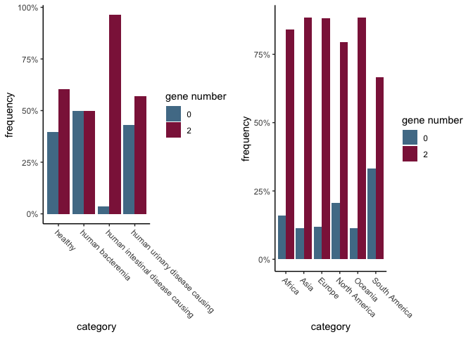
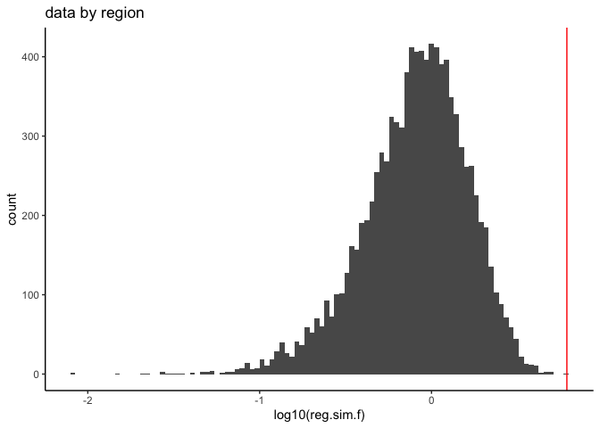
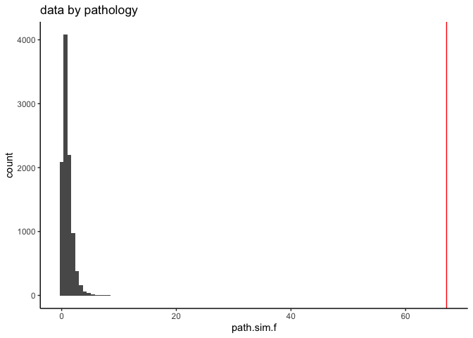
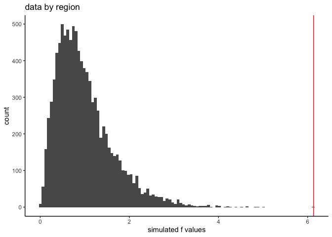

tisB-istR analysis
================

# Analysis of tisB-istR genes

Following the analysis shown in `selene_stats.md`, I’m doing the same
analysis with a different set of genes.

I’ll skip the parametric models and go straight to the ANOVA with Monte
Carlo that I described previously.

``` r
library(tidyverse)
theme_set(theme_classic())
source("R/recreate_raw_data.R")


tisB_region <- read_gene_freq_data("data/tisB_istR_region.csv") 
tisB_path <- read_gene_freq_data("data/tisB_istR_path.csv") 


crap.loop.time <- system.time({ # takes about a minute on my machine
  raw_tisB_region_data <- recreate_raw(tisB_region) #%>%
  #arrange(category, gene.count)# This is running really slowly,
# Issues a message about data.table, whcih I thought was not loaded. Hmmm....
  raw_tisB_path_data <- recreate_raw(tisB_path)# %>%
  #arrange(category, gene.count)
})


p_region_tisB <- raw_plot(tisB_region)
p_path_tisB <- raw_plot(tisB_path)

# Really a bar graph will do fine here
p_tisB_region_b <- barplot_2(tisB_region) + 
  scale_fill_manual(name="gene number", values = c("#517c96", "#8D2048"))
p_tisB_path_b <- barplot_2(tisB_path) +
   scale_fill_manual(name="gene number", values = c("#517c96", "#8D2048"))


cowplot::plot_grid(p_tisB_path_b, p_tisB_region_b)
```



Now we just need to do the analysis of whetehr those distributions are
different among categories.

``` r
tisB_path_model <- lm(gene.count ~ category, data=raw_tisB_path_data)
summary(tisB_path_model)
```


    Call:
    lm(formula = gene.count ~ category, data = raw_tisB_path_data)

    Residuals:
         Min       1Q   Median       3Q      Max 
    -1.92519  0.07481  0.07481  0.07481  1.00000 

    Coefficients:
                                             Estimate Std. Error t value Pr(>|t|)
    (Intercept)                               1.20690    0.08599  14.034  < 2e-16
    categoryhuman bacteremia                 -0.20690    0.13668  -1.514    0.131
    categoryhuman intestinal disease causing  0.71829    0.09200   7.807 2.61e-14
    categoryhuman urinary disease causing    -0.06928    0.10644  -0.651    0.515
                                                
    (Intercept)                              ***
    categoryhuman bacteremia                    
    categoryhuman intestinal disease causing ***
    categoryhuman urinary disease causing       
    ---
    Signif. codes:  0 '***' 0.001 '**' 0.01 '*' 0.05 '.' 0.1 ' ' 1

    Residual standard error: 0.6549 on 602 degrees of freedom
    Multiple R-squared:  0.2507,    Adjusted R-squared:  0.247 
    F-statistic: 67.14 on 3 and 602 DF,  p-value: < 2.2e-16

``` r
tisB_region_model <- lm(gene.count ~ category, data=raw_tisB_region_data)
summary(tisB_region_model)
```


    Call:
    lm(formula = gene.count ~ category, data = raw_tisB_region_data)

    Residuals:
        Min      1Q  Median      3Q     Max 
    -1.7714  0.2287  0.2356  0.4121  0.6667 

    Coefficients:
                          Estimate Std. Error t value Pr(>|t|)    
    (Intercept)            1.68000    0.14096  11.918   <2e-16 ***
    categoryAsia           0.09131    0.14458   0.632   0.5278    
    categoryEurope         0.08435    0.14360   0.587   0.5570    
    categoryNorth America -0.09208    0.14406  -0.639   0.5228    
    categoryOceania        0.09143    0.18457   0.495   0.6204    
    categorySouth America -0.34667    0.20863  -1.662   0.0968 .  
    ---
    Signif. codes:  0 '***' 0.001 '**' 0.01 '*' 0.05 '.' 0.1 ' ' 1

    Residual standard error: 0.7048 on 1781 degrees of freedom
    Multiple R-squared:  0.01693,   Adjusted R-squared:  0.01417 
    F-statistic: 6.133 on 5 and 1781 DF,  p-value: 1.213e-05

``` r
n <- 10000
#nrow.reg <- nrow(tisB_region)
#nrow.path <- nrow(tisB_path)
reg.f.vec <- vector("double", n)
path.f.vec <- vector("double", n)

set.seed(3230)
region.loop.time <- system.time({
  for(i in 1:n) {
  reg.f.vec[i] <- shuf_calc_f(raw_tisB_region_data)
}
})
set.seed(2112)
  for(i in 1:n) {
  path.f.vec[i] <- shuf_calc_f(raw_tisB_path_data)
  }

# Put simulated f vals in a data frame, and pull out observed f values from the model
f_vals <- data.frame(reg.sim.f = reg.f.vec,
                     path.sim.f = path.f.vec)
reg.f.real <- summary(aov(tisB_region_model))[[1]][1,4]
path.f.real <- summary(aov(tisB_path_model))[[1]][1,4]
```

## f values by region

``` r
p_reg_hist <- ggplot(f_vals, aes(x=log10(reg.sim.f))) + 
  geom_histogram(bins = 100) + 
  geom_vline(xintercept = log10(reg.f.real), color="red")  + 
  ggtitle("data by region")
print(p_reg_hist)
```



The distribution of f values here is pretty weird: note the log scale.
It is being caused by the fact that there aren’t many ways to permute
the labels on the data we have, so we end up with 10000 unique f vals
(despite 10^{4} simulations). Many of these have odd combinations: for
instance if each region gets *either* 0 gene copies or 2 gene copies,
but not a mix of both, the f value will be extreme.

So I’m not very satisfied by this simulation. However, our observed f
value is greater than 100, indicating a p value of 0.

## f values by pathotype

``` r
p_path_hist <- ggplot(f_vals, aes(x=path.sim.f)) + 
  geom_histogram(bins = 100) + 
  geom_vline(xintercept = path.f.real, color="red") + 
  ggtitle("data by pathology")
print(p_path_hist)
```



``` r
f_clean <- f_vals%>%
  filter(is.finite(path.sim.f),
         path.sim.f > 1e-10,
         path.sim.f < 1e10)


p_path_hist_clean <- ggplot(f_vals %>%
                              filter(is.finite(path.sim.f),
                                     path.sim.f > 1e-10,
                                     path.sim.f < 1e10), 
                            aes(x=path.sim.f)) + 
  geom_histogram(bins = 100) + 
  geom_vline(xintercept = path.f.real, color="red") + 
  ggtitle("data by pathology")
print(p_path_hist_clean)
```


